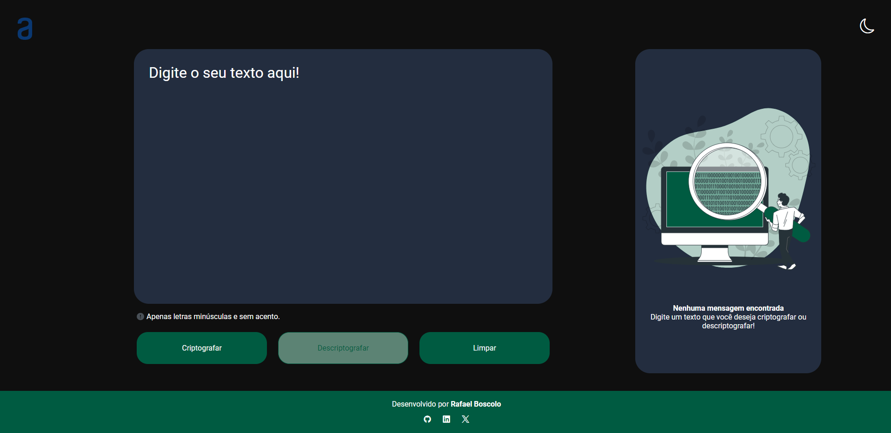
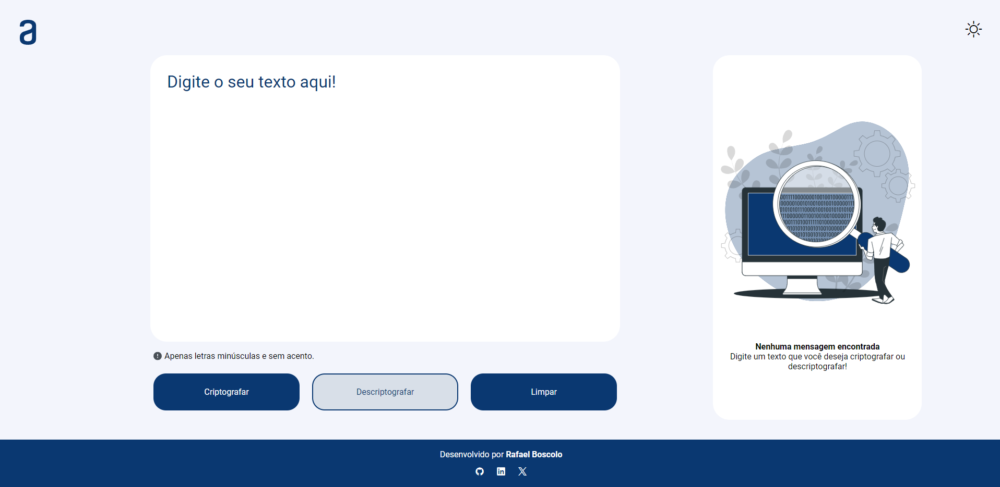

# Projeto Challenge Decodificado

  
  

## Tecnologias Utilizadas
- HTML
- CSS
- JavaScript

## Sobre o Projeto:
- Projeto responsivo apartie dos "max=width: 700px".
- Possui thema Dark e salva o tema preferido do usuário.
- Criptografa o código ou Descriptografa.

## Link:
[Acesse o projeto aqui!](https://rafael-boscolo.github.io/challenge-decodificador/)
